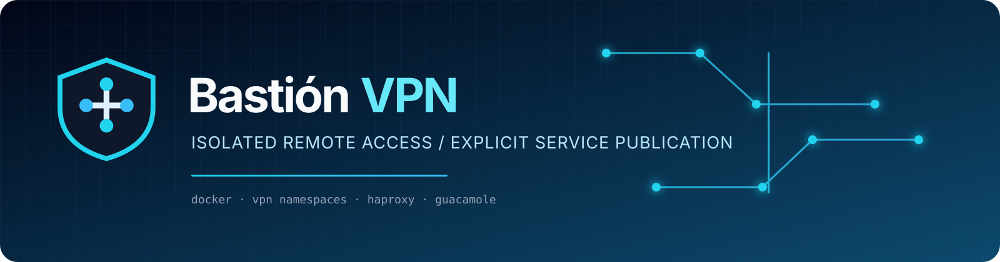
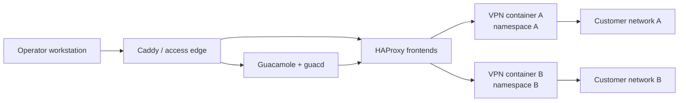
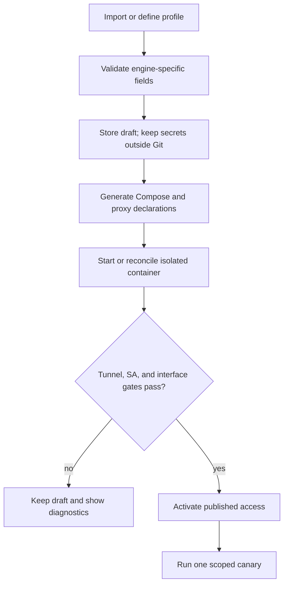
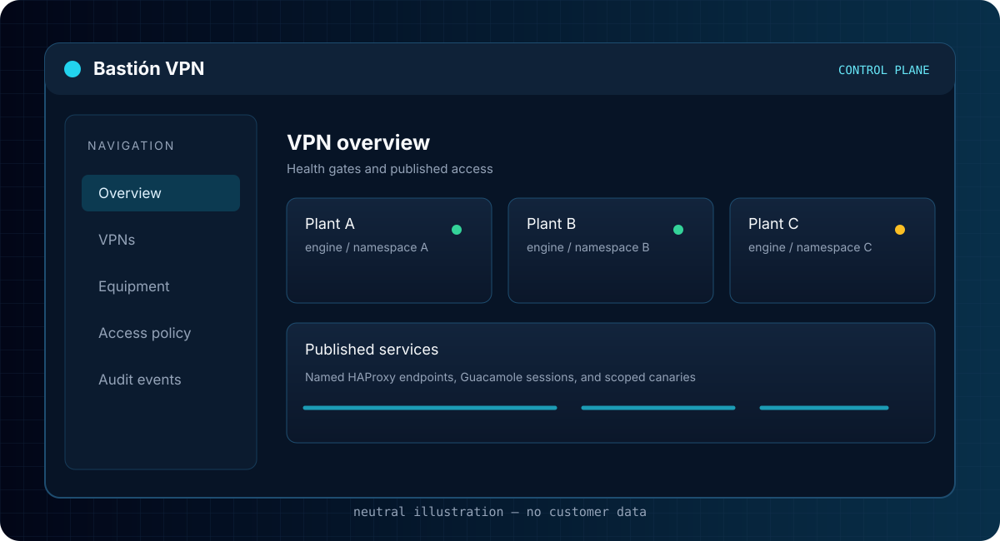

<div align="center">
  
  <h1>Bastión VPN</h1>
  <p><strong>Isolated remote access for teams that operate across many customer networks.</strong></p>
  <p>Self-hosted VPN namespaces, local TCP/HTTP publication, and a controlled access plane built on Docker.</p>
  <p>
    <a href="https://github.com/juanuto/plantas-vpn-bastion/actions/workflows/ci.yml"></a>
    
    
    
    
  </p>
</div>

> **Project status:** public, generic source baseline. The repository contains the reusable control-plane code, templates, tests, and neutral examples; deployment-generated site overlays and all operational data stay outside Git. Read the [installation guide](docs/INSTALL.md) and the [repository boundary](docs/repository-boundary.md) before operating it.

## What is Bastión VPN?

Bastión VPN is a self-hosted multi-VPN access platform for system administrators, MSPs, network engineers, and IT teams. Each customer or plant VPN runs in its own Docker network namespace. HAProxy publishes only explicitly configured HTTP and TCP services, so users can reach remote SCADA, RDP, SSH, VNC, industrial, and application endpoints without installing a collection of vendor VPN clients on their workstations.

The design addresses two operational realities:

- **Per-site isolation:** each generated site data plane gets its own namespace, routes, and proxy boundary.
- **Explicit publication:** HAProxy exposes named TCP/HTTP frontends instead of entire customer networks.

Bastión VPN keeps those concerns inside the bastion and presents a small, auditable set of access endpoints to the operator.

## Features

<table>
  <tr>
    <td width="50%"> <strong>Per-site isolation</strong><br>One VPN data plane per plant, with independent routes and service discovery.</td>
    <td width="50%"> <strong>Explicit publication</strong><br>HAProxy exposes named TCP/HTTP frontends instead of entire customer networks.</td>
  </tr>
  <tr>
    <td> <strong>Secret-aware operations</strong><br>Credentials and profiles stay outside Git and are injected through the deployment boundary.</td>
    <td> <strong>Reconciliation</strong><br>The panel and reconciler keep declared VPN state aligned with Docker runtime state.</td>
  </tr>
  <tr>
    <td> <strong>Web and desktop access</strong><br>Caddy, Guacamole, RDP, and browser-based access share a controlled ingress layer.</td>
    <td> <strong>Operator workflow</strong><br>Validate Compose, inspect health, and promote changes manually with a canary.</td>
  </tr>
</table>

## Why Bastión VPN?

A workstation-centric VPN model breaks down when every customer brings a different client, credential flow, route set, and overlapping address range. It also makes access difficult to audit: the workstation becomes a large, mutable routing domain.

Bastión VPN moves the boundary to a Linux host:

1. A VPN engine establishes one tunnel inside one generated site namespace.
2. The site-local HAProxy reaches only declared remote targets.
3. The central access plane publishes the selected endpoints.
4. Operators use a browser or a normal TCP client without changing workstation routes.

The result is a smaller user-side footprint, clearer blast-radius boundaries, and a configuration model that can be reviewed before promotion.

## Architecture

### Runtime path



Each generated site container owns its VPN interface and route table. Two customer networks may use the same private address because the routes never share a namespace.

### Adding a VPN



Production promotion remains an explicit operator action.

## Screenshots and visual references

The repository does not embed production screenshots or customer topology. It includes neutral SVG illustrations that document the intended control-plane experience without exposing operational data:

- [Control-plane illustration](assets/illustrations/control-plane.svg)
- [Network flow illustration](assets/diagrams/network-flow.svg)
- [VPN onboarding illustration](assets/diagrams/onboarding-flow.svg)



## Installation

### Requirements

- Linux host with Docker Engine and Docker Compose v2.
- Host-level prerequisites appropriate to the selected engine (`/dev/net/tun`, `/dev/ppp`, or IPsec capabilities).
- A protected deployment directory; the example Compose path is `/opt/bastion-vpn`.
- A secret-management process for the panel/Guacamole signing key and generated site VPN material.

See [INSTALL.md](docs/INSTALL.md) for the full procedure and production promotion checklist.

### Quick start

```bash
git clone https://github.com/juanuto/plantas-vpn-bastion.git
cd plantas-vpn-bastion
cp .env.example .env
openssl rand -hex 32  # place the result in .env through your approved secret workflow
docker compose config --quiet
docker compose up -d
docker compose ps
curl --fail http://127.0.0.1/
```

This validates the control plane. It does not create customer VPN credentials or publish a plant automatically.

## Repository structure

| Path | Responsibility |
| --- | --- |
| `panel-app/` | Flask control plane, onboarding validation, reconciliation helpers, and dependency lock list. |
| `templates/` | Generic seeds for generated site Compose, HAProxy, VPN, and Caddy declarations. |
| `configs/` | Policy and deployment-boundary documentation only; generated declarations stay outside Git. |
| `images/` | VPN/proxy images for Fortinet SSL, OpenVPN, Libreswan, and strongSwan variants. |
| `guacamole-server/` | Apache Guacamole source with the CLIPRDR file-transfer customization. |
| `guacamole-json-context-fix/` | Guacamole JSON authentication/build context. |
| `caddy/` | Central ingress and generic publication import point. |
| `templates/` | Generic seeds for generated site Compose, HAProxy, VPN, and Caddy declarations. |
| `scripts/` | Operator tooling, currently `vpnctl`. |
| `tests/` | Focused regression and integration checks. |
| `docs/` | Canonical operator, architecture, security, and contributor documentation. |
| `assets/` | Repository branding and neutral technical illustrations. |
| `.github/` | CI workflows, issue forms, and pull-request policy. |

## Configuration philosophy

Configuration is split into three layers: versioned intent, deployment secrets, and runtime state. `.env`, VPN profiles, private certificates, databases, Docker volumes, logs, and diagnostics stay outside Git. See [CONFIGURATION.md](docs/CONFIGURATION.md) and [repository-boundary.md](docs/repository-boundary.md).

## Adding a VPN

1. Choose the engine and a slug-safe site identifier.
2. Start from the appropriate template in `templates/`.
3. Store the real profile or secret file in the protected deployment directory, never in Git.
4. Generate the site overlay and proxy declarations in the deployment-owned checkout.
5. Run Compose validation and focused tests.
6. Verify tunnel, SA, interface, route, and one approved target.
7. Publish only the required endpoint and record the change.

See [CONFIGURATION.md](docs/CONFIGURATION.md) for the full workflow.

## Security

Bastión VPN is OT-adjacent infrastructure. Do not commit secrets, private keys, live profiles, databases, cookies, raw diagnostic logs, equipment inventories, internal addresses, public endpoints, or customer topology. Do not expose a whole customer subnet when a single HAProxy frontend is sufficient. Preserve generated site namespaces and container identity during promotion. Read [SECURITY.md](SECURITY.md) and [docs/SECURITY.md](docs/SECURITY.md) before operating the platform.

## FAQ and troubleshooting

- [FAQ](docs/FAQ.md) — installation, networking, VPN, RDP, and secret handling.
- [Troubleshooting](docs/TROUBLESHOOTING.md) — evidence-first diagnosis from ingress to target.
- [Endpoint monitor deployment](docs/operations/vpn-endpoint-monitor-deployment.md) — compatible migration, token rotation, canary, and rollback.
- [Endpoint monitor egress](docs/operations/vpn-endpoint-monitor-egress.md) — required host policy and least-privilege probe traffic.
- [Networking](docs/NETWORKING.md) — namespaces, overlapping ranges, and ports.

## Roadmap

| Release | Theme | Outcome |
| --- | --- | --- |
| `0.2` | Operator foundations | Portable Compose inputs, repeatable CI, safer onboarding diagnostics, and backup boundaries. |
| `0.3` | Access governance | User management, RBAC, audit events, and provider-independent authentication hooks. |
| `0.4` | VPN engine expansion | Hardened WireGuard/OpenVPN/IPsec adapters with common health gates. |
| `1.0` | Enterprise baseline | HA deployment, supported upgrades, plugin contracts, and a public security process. |

See the [roadmap](docs/ROADMAP.md) for definitions of done.

## Contributing

Start with [CONTRIBUTING.md](CONTRIBUTING.md). Preserve namespace boundaries, include focused tests for behavior changes, and never submit customer credentials or unredacted topology.

## License

No open-source license has been declared for the Bastión VPN project yet. Until a maintainer adds a `LICENSE` file, no permission to redistribute the project code is granted. Imported Apache Guacamole files remain governed by their upstream `LICENSE` and `NOTICE` files.

## Acknowledgements

- [Apache Guacamole](https://guacamole.apache.org/) for browser-based remote access primitives.
- [HAProxy](https://www.haproxy.org/) for explicit TCP/HTTP proxying.
- [Caddy](https://caddyserver.com/) for ingress.
- [Docker](https://www.docker.com/) and Compose for repeatable isolation boundaries.
