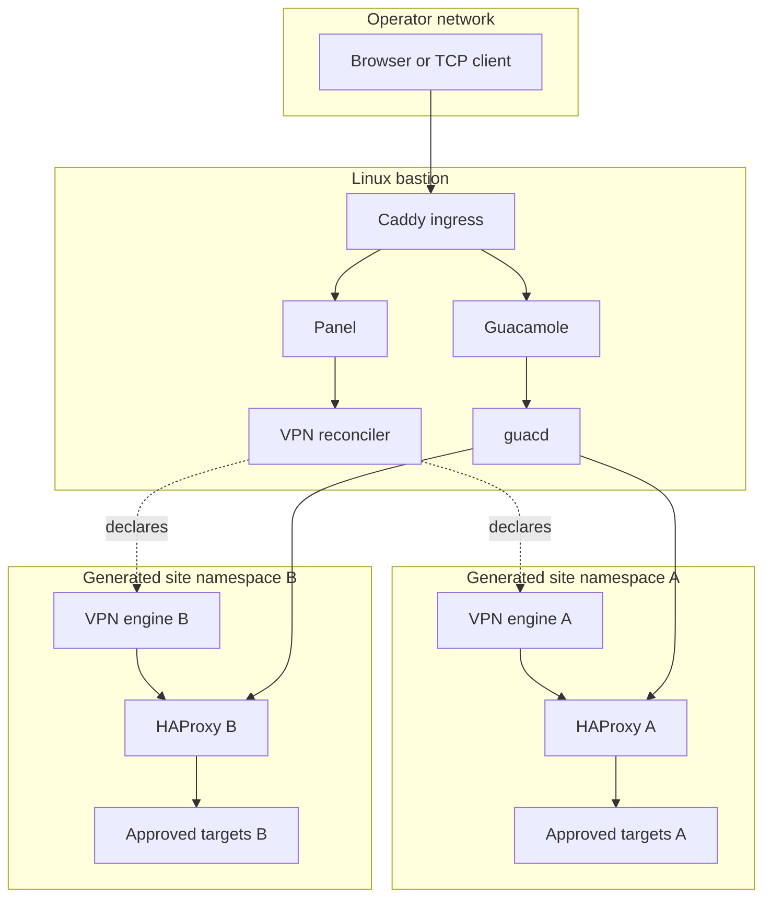

# Architecture

Bastión VPN has a central control plane and one isolated generated site data plane per configured connection. This public tree documents the boundary without shipping any customer deployment data.

## High-level topology



## Control plane

The control plane owns administration, lifecycle reconciliation, browser access integration, and shared ingress. Panel/reconciler Docker socket access is a high-privilege boundary. Guacamole JSON authentication must reject expired or unauthorized connection documents.

## Generated site data plane

A generated site data plane is the smallest isolation unit. Its VPN interface, routes, proxy listeners, and health state are local to that container or Compose project. The central layer connects to a named proxy endpoint rather than joining a customer route table.

This permits overlapping networks: two generated sites may contain the same synthetic address while their route tables remain separate.

## Request paths

```text
Web/TCP:  Operator -> Caddy or listener -> plant HAProxy -> target through plant VPN
RDP:      Browser -> Caddy/Guacamole -> guacd -> plant HAProxy -> target:3389
Lifecycle: profile -> validation -> draft -> overlay -> reconciler -> gates -> activation
```

A tunnel being established is not enough to activate a publication. Verify SA/interface and one target path independently.

## Failure boundaries

| Boundary | Typical failure | Evidence |
| --- | --- | --- |
| Edge | Caddy route or WebSocket failure | Caddy status and access logs |
| Control plane | Panel/auth/session failure | Panel health and redacted logs |
| Proxy | Listener or backend failure | HAProxy config and TCP checks |
| Namespace | Wrong route or target reachability | Probe from plant namespace |
| VPN | Authentication, SA, interface, or route failure | Engine logs and interface state |
| Target | Service/account/security failure | Target-side evidence and timestamp correlation |

## Repository mapping

`panel-app/` is the control plane; `images/` contains data-plane engines; `caddy/`, `guacamole-json-context-fix/`, and `guacamole-server/` are ingress/browser access; `templates/` defines repeatable generated intent; `configs/` contains only boundary policy; `tests/` protects contracts.
