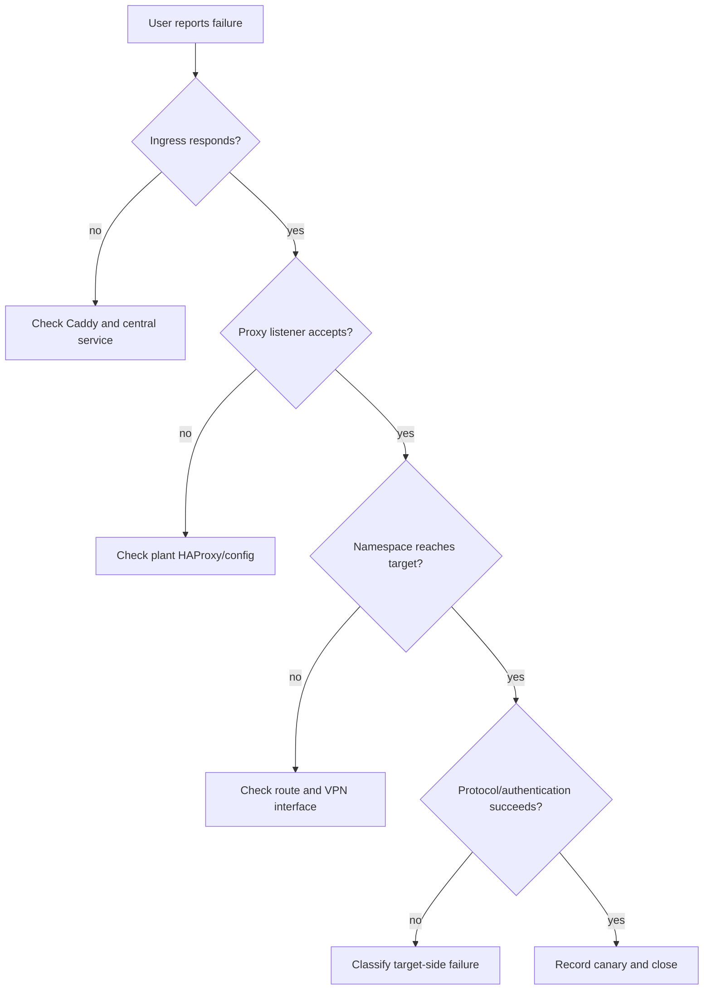

# Troubleshooting

Use the narrowest evidence chain that proves the failing boundary. Do not restart all VPN containers as a first response.

## Decision path



## Safe first checks

```bash
docker compose ps
docker compose config --quiet
docker compose logs --tail=200 caddy
docker compose logs --tail=200 panel
docker compose logs --tail=200 vpn-reconciler
```

Use the approved deployment command to inspect one plant's state and logs. Filter output before sharing it.

## Failure classification

| Symptom | Likely boundary | Next evidence |
| --- | --- | --- |
| 404 or wrong host | Caddy route | Loaded route and host/path match |
| WebSocket closes | Caddy/Guacamole/guacd | Same request timestamp across services |
| Connection refused | Proxy/listener | HAProxy bind and container network |
| Timeout before target | VPN/route | Namespace route, interface, SA, target TCP |
| Authentication failure after TCP | Target account/policy | Target-side account/domain/RDP evidence; stop retries |
| Wrong RDP security type | RDP negotiation | Target behavior and newest guacd event |
| Duplicate target | Namespace selection | Plant slug, proxy port, container identity |
| Reconciler recreates service | Desired/runtime drift | Safe metadata, image digest, Compose hash |

## RDP precautions

Repeated fresh authentication failures can lock an account. Stop retries after a confirmed pattern. A successful desktop launch may use manually entered credentials or Windows Credential Manager; it does not prove a stored panel credential is correct.

Correlate the Guacamole event, central-to-proxy TCP, namespace-to-target TCP, VPN SA/interface health, and target-side policy evidence without printing secrets.

## Rollback

Stop promotion, preserve evidence, restore the previous exact bundle, and verify the affected plant only. Do not delete databases, volumes, or credentials during diagnosis.
